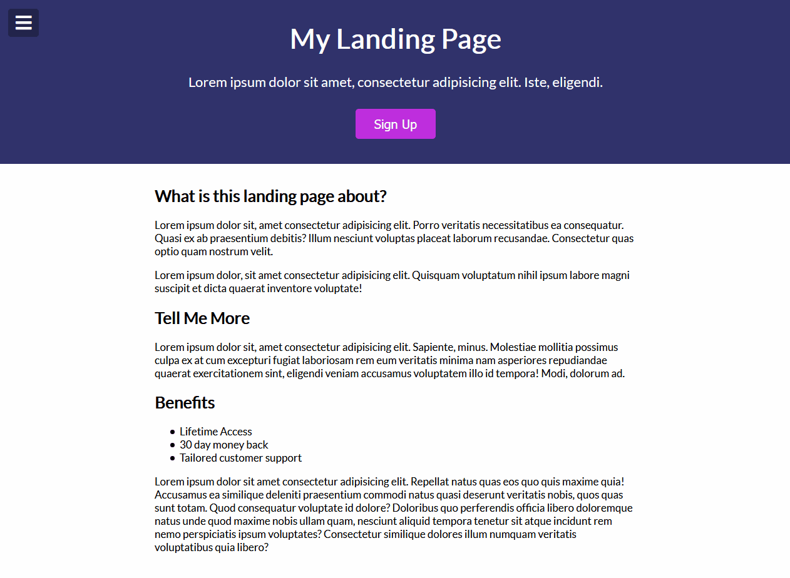

# Menu & Modal Slider
Creating interactive modal/sidebars using primaryily HTML/CSS. 

## Project Preview

[LIVE DEMO](https://kelenam.github.io/menu-slider-modal/)

## How to Install
- `git clone` this repo
- No hard dependencies required to run so no need for `npm/yarn` installs. 
- Just open the `index.html` file or use server of your choice.
- Note: If modifying the file, and you have TS already installed, you can just call `tsc --watch` in the root project directory to compile your js into appropriate dir.
- I'd recommend using the VSCode Sass Plugin as well.  

## Project Notes
- Things I learned in this: `lorem#` for Emmet shortcut where `#` is the number of words of lorem you want.
- Reminded of using partials in SASS with `_filename.scss` and `@import 'filename`
- Using `:first-type-of` psuedo selctor to grab the first type of an element in a sequence
- Styling all buttons and inputs with a a submit type is looks like ....
```css
button,
input[type='submit'] {
    /* ... */
}
```
- Use `-` to separate css property abbreviations with Emmet. For instance, if you wanted `margin: 0 auto;` the shortest way to say this is `m0-a`, where 0 is your top and bottom and a is auto for left and right.
- If you want to style a container so that on a screen that is less than 800px it will take up the full width of the page, but only stay constrained to 800px on screens bigger than 800px, how would you approach this? You would set the max width to be 100% and the regular width to be 800px or whatever ccontainer size you want.
- How do we get our absolutely positioned modal more centered to the page? Why do we need to do this? We can use `transform: translate(-50%, -50%)`, which takes in an x and y values, set to 50% to get our absolutely positioned modal more towards its own middle rather than being positioned by its origin (top, left point).
- Note: I ran into some TS issues with [close](https://developer.mozilla.org/en-US/docs/Web/API/Window/close)/[open](https://developer.mozilla.org/en-US/docs/Web/API/Window/open) being already declared on this block level so, I just renamed them to `openState` and `closeState`.
- The difference between the two is that the space between selectors suggests the first selector is the parent tag of the ensuing selctors, `.class .descendant` , `.descendant` would be a descendant of `.class` whereas `.class1.class2` is saying class lists that match having both classes `class1` and `class2`. So we could say `body` tags that have a class of `show-modal` like `body.show-modal` whereas `body .show-modal` is styling the `.show-modal` class where it is a descendent of `body`. 